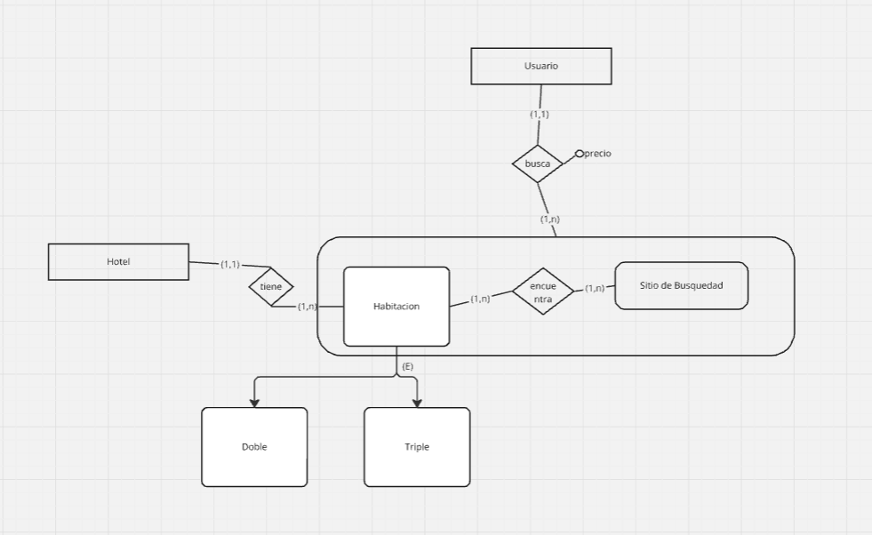

PUNTO 1
a) Esto lo indica en la relación "expuesto" donde la cardinalidad es (1,N). Esto se lee como "Un período puede tenes 1 o N cuadros expuestos en un museo" y las cardinalidades dentro de la agregación son N a N. 
Para poder hacer que un período pertenezca exclusivamente a un cuadro en un museo tenemos que cambiar la cardinalidad del período a (1,1) "Un período tiene uno y solo una pintura en un museo." 

PUNTO 10 

